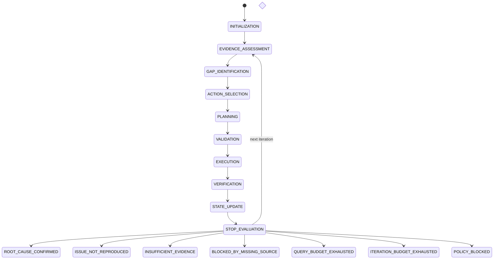

# Deterministic Investigation State Machine

The state ledger is enabled with `FEATURE_AGENTIC_INVESTIGATION_ENABLED=true`.
The default is `false`, preserving the existing non-agentic investigation path.

Every transient state also supports `FAILED` and `CANCELLED`. Policy and budget
terminal states are reachable at their relevant decision boundaries. Terminal
states reject every subsequent transition.

Each persisted transition records investigation, organization and workspace
scope, previous/current state, UTC timestamp, reason, and iteration number.

Read-only API:

- `GET /investigations/{investigation_id}/state`
- `GET /investigations/{investigation_id}/state/history`
