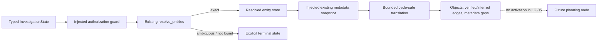

# Entity and relationship adapter design

## Scope

LG-05 connects only the isolated LangGraph `resolve_entity` and `discover_objects`
nodes to existing service contracts. It does not activate the graph from an API or
worker, add an LLM call, execute a stored procedure, or change SQL validation,
timeouts, row limits, authorization, evidence audit, or benchmark isolation.

## Existing architecture inspection

| Concern | Existing service and exact method | Adapter | State fields | Error translation | Safety boundary |
|---|---|---|---|---|---|
| Workspace authorization | `security/access_control.py::require_workspace_access` is called by `routers/chat.py::ask_question`; an equivalent authorized guard is injected | both | no credentials stored | `PermissionError` → `WORKSPACE_ACCESS_DENIED` or `METADATA_ACCESS_DENIED` | authorization occurs before service access |
| Entity extraction | `agents/entity_extraction_agent.py::extract_entities` | `EntityResolutionAdapter` | request → extracted service input | dependency failure → `ENTITY_RESOLUTION_UNAVAILABLE` | deterministic extraction; requested entity takes precedence |
| Entity resolution | `services/entity_resolution_service.py::resolve_entities` and `_resolve_one` | `EntityResolutionAdapter` | resolution status, candidates, resolved entities, method, explanation, ambiguity | unavailable is retryable; ambiguous/not-found are explicit terminal states | exact lookup precedes bounded safe partial lookup; existing evidence executor retains validation, limits, and timeout |
| Metadata discovery | `services/metadata_search_service.py::search_metadata` producing `MetadataSearchResult`/`TableMetadata` | `RelationshipDiscoveryAdapter` | candidate/selected/required/optional objects, edges, gaps | unavailable → retryable `METADATA_DISCOVERY_UNAVAILABLE`; permission gaps are retained | injected snapshot is scoped by the existing context/cache boundary |
| PK/FK/index metadata | `TableMetadata.primary_key`, `.foreign_keys`, `.indexes` | relationship adapter translator | verified FK, self-FK, and unique-key edges | incomplete objects become gaps | no query or inference is performed by translation |
| Procedure dependencies | `services/stored_procedure_intelligence.py::analyze_stored_procedures` producing `ProcedureAnalysis` | relationship adapter translator | procedure objects and read/write edges | missing permissions become gaps | all routines are inspection-only; mutation or dynamic SQL is unsafe to execute |
| View dependencies | existing connector/metadata boundary, passed as the snapshot's `view_dependencies` | relationship adapter translator | view objects and verified dependency edges | unavailable dependencies become gaps | dependency inspection only |
| Existing inferred/business relations | existing discovery result passed as `inferred_relationships` | relationship adapter translator | inferred edges | never promoted to verified | adapter adds no inference rules |

The active investigation remains
`routers/chat.py::ask_question` → `routers/chat.py::_run_dynamic_investigation`.
The background path remains the existing investigation worker entry point documented
in `current-investigation-flow.md`. Neither path imports or invokes these adapters.

## Data and decision mapping

Entity candidates retain their identifier, table, column, deterministic order,
confidence, evidence ID, matching method, and verification status. Exact matches are
resolved; multiple safe candidates are preserved and terminate as ambiguous; no match
terminates as entity-not-found. Provider-assisted ranking is explicitly disabled.

Relationship traversal starts only from a verified resolved entity or explicitly
requested object. It is breadth-first, case-insensitively cycle-safe, edge-deduplicated,
and bounded by `max_depth` and `max_objects`. The first resolved object is required;
related tables, views, and routines are optional. Limit, missing-object, and partial
permission conditions are persisted as `metadata_gaps`.

Cross-database names are not rewritten or silently brought into scope. A name absent
from the already-authorized snapshot becomes a blocking missing-object gap.

## Workflow sequence

## Dependency injection and isolation

Connectors, authorization context, metadata loaders, and resolver callables live on
frozen adapter instances, never in serializable workflow state. Module import and
graph construction perform no network, database, Azure, or LLM work. Tests use service
contract fixtures only. Each invocation returns new collections, allowing a compiled
graph to be reused without cross-run state leakage.

## Known limitations and future integration

- A later task must construct production adapters only after route-level workspace,
  connection, environment, and active-schema validation.
- View dependency collection must be supplied by the existing engine-specific
  metadata boundary; LG-05 does not introduce database-specific discovery SQL.
- The adapter records unique indexes as relationship facts. Primary keys remain on
  their table object and verified FK edges carry referenced columns.
- No graph checkpointing, API activation, planning, SQL generation, SQL execution,
  evidence persistence, Evidence Gate, reasoning, or report integration is included.
