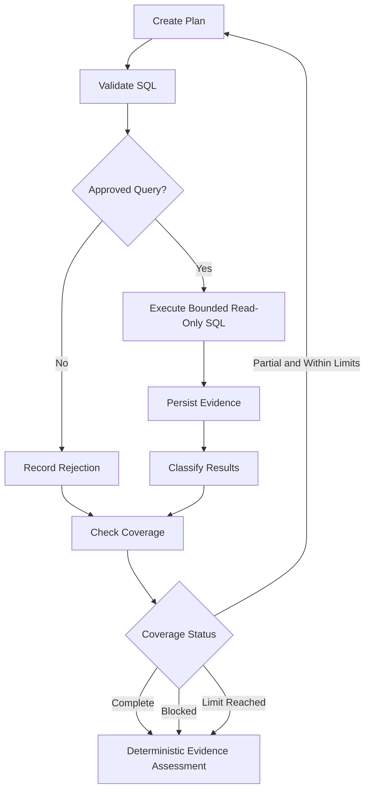

# Evidence-driven LangGraph loop design

## Scope and production isolation

LG-06 adds an isolated, dependency-injected evidence loop. The active route remains
`routers/chat.py::ask_chat_question` → `_run_dynamic_investigation`; it does not import
or construct this graph. No LLM, Azure service, live SQL Server, stored-procedure
execution, report generator, external checkpoint, or production Evidence Gate is
connected.

## Existing service inventory and mapping

| Existing service → method | Adapter/node | State inputs | State outputs | Failure mapping | Preserved safety |
|---|---|---|---|---|---|
| `safe_investigation_planner.SafeInvestigationPlanner.select_next` and `action_fingerprint` | `PlanningAdapter` / `create_plan` | sanitized question, entities, objects, relationships, durable evidence IDs, completed work, budgets | structured steps and proposed queries | no eligible work becomes no-progress/limit state | required-first ranking, duplicate suppression, iteration/query policy |
| `safe_sql_service.plan_safe_queries` through an injected query-generator boundary | `PlanningAdapter` | one selected logical request | `QueryRecord` proposals | no safe query creates no progress | SQL generation performs no execution |
| `safe_sql_service.validate_read_only_sql` | `SQLValidationAdapter` / `validate_sql` | proposed query plus authorized scope | approved/rejected query records | rejection code/reason is sanitized | SELECT/CTE-only parsing; DML, DDL, EXEC and multiple statements remain rejected |
| `safe_sql_service.ProductionReadSafetyValidator.validate` through injected `production_safety` | `SQLValidationAdapter` | read-only SQL | policy-bounded SQL | policy violation is a rejection | row/full-scan/environment policy remains authoritative |
| `evidence_execution_service.execute_evidence_plan` | `SQLExecutionAdapter` / `execute_sql` | approved-only query records | bounded summaries and execution status | timeout, permission, blocked and failure stay distinct | dialect preflight, repeated read-only validation, row limit, scan policy, connector read-only call |
| existing workspace/database authorization boundaries | injected authorization callbacks | workspace ID and sanitized target metadata | allow/deny only | denied access is an explicit rejection/gap | no connection, session, cursor, credential, or string enters state |
| existing investigation evidence JSON/audit persistence boundary | injected `PersistEvidence` callback / `preserve_evidence` | bounded execution result and classification | durable evidence reference | persistence failure raises `EVIDENCE_PERSISTENCE_FAILED` and blocks later nodes | evidence is durable before verification/coverage |
| `EvidenceResult` semantics and existing evidence-gap vocabulary | `EvidencePreservationAdapter` | row count, bounded rows, execution status, evidence goal | findings and gaps | failed results never become verified evidence | empty and NULL results remain evidence; raw large results remain external |
| existing required-object coverage rules (`state.calculate_coverage`) | `CoverageAdapter` / `check_coverage` | required objects, successful/inaccessible objects, blocking gaps, limits | percentage, missing objects, status | partial/blocked/limit are explicit | optional objects excluded from denominator |
| `agentic_investigation_loop.AgenticLoopLimits` and planner budgets | graph conditional edge | planning/query/object/no-progress counters | replan or safe stop | limit routes to deterministic assessment | finite loop; defaults are 3 rounds, 10 queries, 20 objects, 1 no-progress round |

The production multi-step loop also persists `InvestigationAgenticStepModel` rows and
audit events. A future activation task must inject that same session-scoped persistence
boundary rather than storing a SQLAlchemy session in state.

## Node and routing design

The complete sequence is `initialize`, `resolve_entity`, `discover_objects`,
`create_plan`, `validate_sql`, `execute_sql`, `preserve_evidence`,
`classify_results`, `check_coverage`, `assess_evidence`, `compose_report`, and
`finalize`. The last two remain deterministic placeholders.

## Planning, joins, and stored procedures

The planner receives only typed serializable records. Required objects rank ahead of
optional ones. Completed object work and rejected query hashes are suppressed. A
stable SHA-256 logical-action fingerprint detects repeated plans without including
SQL or secrets. Relationship identifiers and JOIN justification survive on each plan
step. Verified and inferred edges retain their original verification status; query
results never promote an inferred schema relationship.

Routine objects always produce definition/dependency inspection requests. Mutation
and dynamic-SQL flags remain on the object, `inspection_only` remains true, and no
`EXEC`/`EXECUTE` reaches execution. Dynamic or inaccessible definitions create
blocking metadata gaps and human-review context.

## Validation and execution safety

Authorization runs before validation and again before execution. Every proposal uses
the existing read-only validator, then the production safety boundary. Parameter
metadata contains names and types only. The existing execution service again performs
dialect validation, read-only validation, production scan validation, bounded
connector execution, and error classification. Only approved records are converted
to `PlannedQuery`. Large rows are excluded; state keeps at most five sanitized summary
rows and a durable result reference.

## Evidence classification and persistence

Persistence precedes coverage and assessment. Evidence IDs are append-only and
verified references cannot be downgraded. A successful empty query is durable
`NO_MATCHING_ROW` evidence. A row with required `DateOfBirth = NULL` produces
`REQUIRED_VALUE_MISSING` plus `CALCULATION_NOT_POSSIBLE`; an optional NULL produces
`OPTIONAL_VALUE_NULL`. A nullable target from a multi-object join produces
`RELATIONSHIP_NOT_PRESENT` without treating the source row as missing. Aggregate NULL
is retained as NULL; it is never changed to zero without a business rule.

Timeout and permission outcomes create gaps, not fabricated evidence. If execution
succeeds but persistence fails, execution metadata remains in state, no evidence ID
is verified, the wrapper records a sanitized blocking error, and later reasoning and
report nodes do not run.

## Coverage and replanning

The denominator is the count of unique required qualified objects. The numerator is
the required objects with durable conclusive evidence. Optional objects never affect
the percentage. No required objects means `NOT_STARTED`; inaccessible required
objects are `BLOCKED`; unresolved work is `PARTIAL`; all required work without a
blocking gap is `COMPLETE`.

Partial coverage loops to planning only while round, query, object, duration/caller
deadline, cancellation, repeated-plan, and no-progress controls allow it. Complete,
blocked, and limit-reached states route to deterministic assessment. Cancellation
routes to finalization, prevents new execution, and leaves earlier durable evidence
unchanged.

## Deterministic assessment and telemetry

Assessment sets only `reasoning_allowed`, `reasoning_mode`,
`provider_call_required=false`, a decision reason, and an LG-06 skip reason. It makes
no provider call and does not replace Evidence Gate.

Existing node telemetry continues to record node, duration, success, error code, and
workflow iteration. Planning rounds, query/step IDs, outcomes, evidence IDs,
classification, coverage, missing objects, replan reasons, limits, and no-progress
values are available in sanitized state for the injected audit/telemetry boundary.
Raw results and secrets are never telemetry fields.

## Test strategy, limitations, and next seam

Unit tests use real adapters around fake service boundaries. Integration tests compile
the graph with no network, Azure, SQL Server, or LLM. Existing optional SQL Server
tests retain their environment-gated skips. The next milestone can inject production
session-scoped evidence/audit persistence, Evidence Gate, reasoning, and reporting
after explicit route activation review. Production activation remains disabled.
