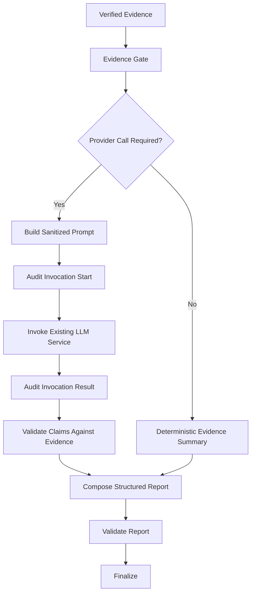

# Evidence-gated reasoning and reporting design

## Scope

LG-07 connects the isolated workflow to existing Evidence Gate, reasoning-dispatch,
provider/audit, claim-verification, report-composition, and report-validation
boundaries. Production activation remains deliberately disabled. The active route is
still `routers/chat.py::ask_chat_question` → `_run_dynamic_investigation`.

## Existing service mapping

| Existing service → method | Adapter/node | State input | State output | Audit behavior | Failure mapping |
|---|---|---|---|---|---|
| `evidence_gate_service.run_evidence_gate` | `EvidenceGateAdapter` / `apply_evidence_gate` | durable evidence IDs and a production-built gate bundle | sanitized gate decision | no invocation row | operational defects remain visible |
| `reasoning_dispatch_service.dispatch_reasoning` | `EvidenceGateAdapter` | `EvidenceGateResult` | permission, mode, provider-call decision, skip reason | decision remains available to investigation audit | no evidence, partial coverage, blockers, and cancellation skip provider |
| existing prompt construction in `llm_reasoning_service.enhance_reasoning_with_llm` | injected prompt builder / `invoke_reasoning` | authorized context plus loaded durable evidence | prompt hash/count only | approved sanitized prompt representation is owned by existing audit | exact evidence-set mismatch blocks invocation |
| `llm_provider_client.AuditedLLMProviderClient.invoke_json` | injected provider facade / `invoke_reasoning` | sanitized system/user prompts | structured provider response | real calls start and complete/fail an audit record | timeout/rate-limit/unavailable produce deterministic fallback |
| `llm_invocation_audit_service.LLMInvocationAuditService` | injected `InvocationAudit` facade | investigation/node/model/prompt/evidence metadata | real invocation ID, token/cost/duration status | no-call path creates no row or ID | audit start/completion failure is explicit and blocks unauditable reasoning |
| `claim_verification_service.build_evidence_registry`, `parse_structured_claim`, `verify_claim` | `ReasoningValidationAdapter` / `validate_reasoning` | reasoning claims and persisted verified evidence | accepted claims, verification records, claim/evidence links | validation outcome enters telemetry | missing/unknown/contradictory citations are rejected |
| `report_composer_agent.compose_report` | injected production composer / `compose_report` | validated persisted reasoning or deterministic evidence state | sanitized structured report | invocation status and evidence references included by composer | unsafe/unpersisted reasoning selects deterministic composer |
| existing report-quality and claim-validation boundary | `ReportValidationAdapter` / `validate_report` | structured report and investigation evidence registry | validation errors, review flag, artifact IDs | artifact IDs enter telemetry | invalid report is not persisted as validated |
| existing report artifact persistence | injected report persistence callback | validated report only | durable artifact references | normal report/audit persistence remains session-scoped | persistence failure becomes a sanitized operational error |

## Flow

The complete graph retains all LG-06 nodes and adds `apply_evidence_gate`,
`invoke_reasoning`, `validate_reasoning`, and `validate_report`.

## Reasoning modes and provider decision

`dispatch_reasoning` maps to `NORMAL_ROOT_CAUSE`,
`EVIDENCE_SUMMARY_NOT_REPRODUCED`, `INSUFFICIENT_EVIDENCE`,
`NO_VERIFIED_EVIDENCE`, `NEEDS_HUMAN_REVIEW`, or `SKIP`. Normal root-cause
reasoning requires durable verified evidence and reproduction. Partial/limited
coverage blocks a provider call. Dynamic SQL, inaccessible required evidence,
persistence failures, and blocked coverage require human review. No verified evidence
produces an explicit skip reason and zero invocation IDs.

## Verified-evidence prompt and sanitization

The evidence loader must return exactly the requested persisted verified evidence IDs;
missing or extra records block invocation. Unverified results, rejected SQL, raw
connections, credentials, benchmark keys, and unrestricted rows are not inputs.
Existing sanitization is applied and prompts are capped at 24,000 characters. Grounding
rules require citations, labeled inference/gaps, correct NULL/no-row semantics, no
invented age or records, no unsupported root cause/correction/proof-of-fix, retained
relationship verification, and procedure-inspection-only wording.

State stores only a prompt hash, evidence count, provider/model, tokens, estimated
cost, and real invocation IDs. It never stores the prompt or API credentials.

## Invocation audit lifecycle

Audit start occurs before the provider boundary. A missing audit ID prevents the call.
Completion captures model/provider, tokens, cost, and completion status. Failure
updates the same real row. No provider call means no fabricated row. Audit completion
failure blocks use of the response and records incomplete auditability. Cancellation
is checked before the gate, before invocation, and after response through both state
and an injected cancellation callback.

## Reasoning and claim validation

The existing evidence registry and verifier reject missing or unknown citations,
truncated/non-prompt evidence, unverified negative evidence, contradictory content,
and content not supported by cited rows. Compatibility checks additionally reject an
age when DOB is NULL, NULL claims when no row exists, inferred relationships described
as verified FKs, procedures described as executed, and proof-of-fix without post-fix
evidence. Rejected claims are removed and trigger human review.

## Reporting and validation

Validated durable reasoning uses the existing structured composer facade. Skipped,
failed, unaudited, unpersisted, or invalid reasoning uses a deterministic evidence
summary. Both paths preserve entity resolution, findings, reproduction, coverage,
gaps, blocked objects, routine restrictions, evidence IDs, invocation status, safety
notes, and limitations.

Report validation checks schema, evidence ownership, unsupported conclusions/actions,
proof-of-fix, NULL/no-row semantics, secrets, and terminal-state consistency. Invalid
reports retain errors and require review; only validated reports receive persisted
artifact IDs.

## Failure, telemetry, tests, and next milestone

Provider timeout, rate limit, malformed response, unavailability, and token failures
retain verified evidence and select deterministic fallback. Reasoning, audit, and
report persistence failures remain explicit. Telemetry adds gate decision, reasoning
mode, provider-call requirement, real invocation ID, provider/model, prompt hash and
evidence count, token/cost fields, claim/report validation outcomes, artifact ID, and
fallback reason without raw prompts or results.

Standard tests use fake providers and persistence facades and need no credentials,
network, Azure, SQL Server, LangSmith, or billing. LG-08 may add explicitly reviewed
feature-flag activation, production dependency construction, rollback controls, and
operational monitoring. No activation or dual-orchestrator routing is part of LG-07.
