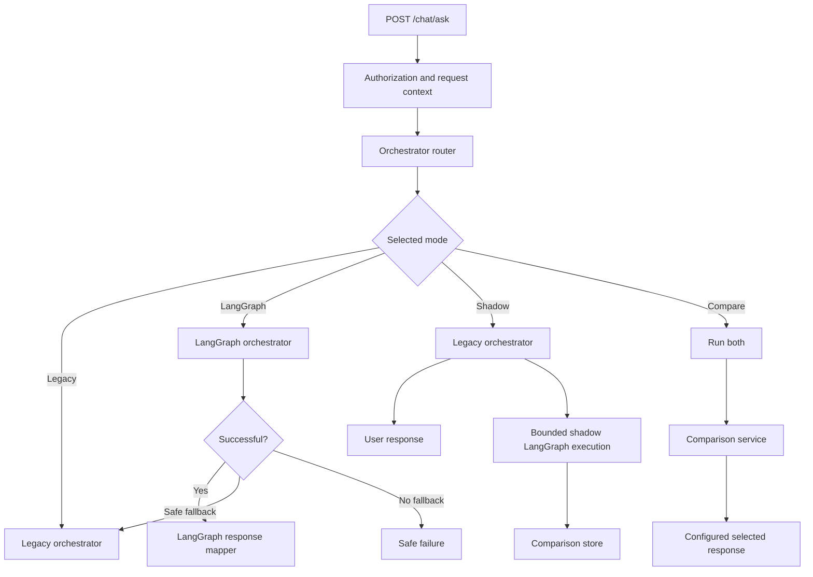

# LangGraph production activation design

## Architecture

The existing synchronous investigation remains the default. Authorization, environment
resolution, connection selection, and scan-policy resolution still happen before orchestration
selection. The endpoint creates a common orchestration context and delegates to
`InvestigationOrchestratorRouter`. The legacy adapter calls `_run_dynamic_investigation`
unchanged. A LangGraph candidate can be registered only through the production composition
root.

## Configuration and precedence

`Settings` owns the integration configuration. Defaults are `LEGACY`, disabled, zero rollout,
zero shadow, fallback enabled, kill switch off, and shadow LLM disabled. Invalid modes parse as
`LEGACY`; invalid percentages become zero and valid percentages are clamped to 0–100.

Selection precedence is: kill switch, enabled flag, environment allowlist, workspace allowlist,
user allowlist, explicit mode, rollout cohort, shadow cohort, legacy default. `COMPARE` is
restricted to development, testing/test, and staging. Allowlist contents never appear in health
output.

Percentage assignment is `SHA-256(workspace_id + separator + user_id)`, reduced to a stable
0–99 bucket. Telemetry may retain the digest but not the raw key. An incomplete key cannot enter
a rollout cohort.

## Composition and API compatibility

`workflow/langgraph/composition.py` compiles the LG-07 graph from
`ReasoningReportingWorkflowHandlers`. Those handlers are the request-scoped facades over the
existing authorization, entity, metadata, planner, validator, executor, evidence, Evidence Gate,
provider audit, claim, report, telemetry, cancellation, clock, and ID services. Connections and
provider clients never enter graph state. State serialization is validated before invocation.

The composition is registered at application lifetime and is replaceable with `None`, the safe
rollback state. A single compiled graph is reusable; each request receives a fresh state and
independent correlation/investigation IDs. The response mapper returns the existing internal
response payload; raw state is never exposed to the frontend.

## Modes and failure policy

- `LEGACY`: invokes legacy only and remains authoritative.
- `LANGGRAPH`: invokes the registered graph only. Missing composition or a pre-result exception
  falls back when enabled.
- `SHADOW`: returns legacy only, then performs a bounded candidate execution synchronously.
- `COMPARE`: lower-environment mode that runs both; legacy is selected in LG-08.
- `DISABLED`: invokes neither and returns a safe service-unavailable response.

Shadow and comparison errors, comparison-store errors, and metrics errors cannot alter the
selected response. Primary authorization, evidence-persistence, and safety failures remain
visible. Automatic fallback is currently limited to missing composition and exceptions before a
usable `OrchestrationResult`; it does not silently retry after a returned provider/audit result.
This conservative policy avoids duplicate provider calls and conflicting durable artifacts.

`LANGGRAPH_COMPARE_RESPONSE_SOURCE` defaults to `legacy`; only the explicit sanitized value
`langgraph` selects the candidate response in authorized compare mode.

## Shadow isolation and cost/load controls

Shadow reasoning is disabled by default. The candidate receives `reasoning_enabled=false`,
records `shadow_llm_disabled`, and creates no fake invocation ID. Enabling it requires an allowed
environment plus explicit configuration and still uses the normal Evidence Gate/audit boundary.

Execution uses a non-blocking bounded semaphore. Existing per-query timeouts, row limits, query
limits, read-only validation, cancellation, and evidence persistence remain in the handlers.
There are no fire-and-forget tasks. Shadow runs are synchronous and therefore intended for lower
environments until a supervised worker dispatch is approved.

Expected load is approximately 1× in legacy mode and up to 2× database reads in shadow/compare.
Compare with reasoning can approach 2× provider activity. Production shadow defaults to zero.

## Comparison and release safety

Comparison scores safety (30), evidence correctness (25), coverage (15), claim support (10),
terminal behavior (10), latency (5), and cost (5). It also records evidence, query, invocation,
token, cost, latency, and terminal differences. Authorization, NULL/no-row, mutation,
stored-procedure execution, or unverified-evidence/provider mismatches override textual
similarity and produce `BLOCKED`.

Persistence is optional behind `ComparisonStore`; failure is isolated. No migration was added.
An existing access-controlled repository/artifact store must be supplied before persisted
production comparisons are enabled.

Release gates reject mutation/procedure execution, authorization violations, unverified provider
input, fabricated audit rows, secret leakage, unsupported proof-of-fix, regression failures,
unsafe defaults, and a broken kill switch.

## Telemetry, health, and limitations

Router telemetry contains mode, reason, cohort, hashed rollout key, kill-switch state, fallback,
comparison category, and sanitized errors. Graph telemetry continues to contain node, evidence,
gate, invocation, token, cost, validation, and report fields. Correlation IDs join the API,
orchestrators, comparison, audit, and artifacts.

Effective-runtime diagnostics expose sanitized installed/compile/enabled/mode/kill-switch/
fallback/percentage/dependency fields. A missing graph composition does not make legacy
readiness fail.

Known limitations: production service facade registration is deployment-specific; comparison
persistence needs an approved existing repository; shadow runs are request-bound rather than
worker-supervised; configuration refresh requires the application’s normal environment refresh
or restart; no distributed circuit breaker was introduced.

`GET /health` remains a liveness summary. `GET /ready` is the fail-closed dependency gate and
checks the control database, Alembic head, provider/model configuration, credential presence when
reasoning is enabled, the legacy route, and LangGraph composition when LangGraph is enabled.
Worker runtime diagnostics contain the same sanitized readiness snapshot.

Protected benchmark labels are not routing evidence. Before creating a run, the runner requires
the requested orchestrator to match API health. A LangGraph run additionally requires enabled,
compiled, registered composition. `--orchestrator langgraph` cannot relabel a legacy API run.
