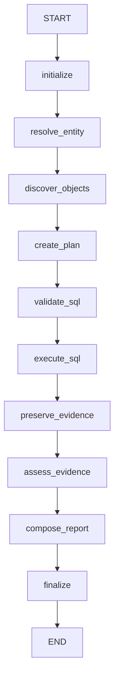

# Linear LangGraph Workflow Skeleton

## Purpose and isolation

LG-04 proves that LangGraph 1.2.9 can orchestrate the typed `InvestigationState` from LG-03 in a
deterministic linear workflow. It validates compilation, ordering, state propagation, telemetry,
sync/async invocation, and failure representation. All business behavior is injected; no
production entity, metadata, SQL, evidence, reasoning, audit, or report service is connected.



The graph contains exactly these ten nodes and eleven unconditional edges. It has no loop,
conditional route, re-planning path, checkpointer, migration, or background worker.

## Preliminary design findings

- Existing dependency injection favors constructors, protocols, and dataclasses. The skeleton uses
  a frozen `InvestigationWorkflowHandlers` dataclass of callables and a `TelemetryRecorder`
  protocol.
- Existing services are primarily synchronous. The production `/chat/ask` path is synchronous,
  while LangGraph exposes both `invoke` and `ainvoke`; both are supported and tested here.
- Existing telemetry uses structured audit records and logging with investigation/workspace
  correlation. The skeleton emits structured local `NodeTelemetryEvent` records through an
  injected recorder and sends nothing externally.
- Existing expected failures are represented as explicit statuses and sanitized details, whereas
  unexpected application defects surface to the API boundary. The wrapper follows that split.
- Existing cancellation is explicit in the persistent state machine and agentic loop. LG-04
  respects terminal cancellation state as a halt condition but does not connect the cancel API.
- Tests commonly use lightweight fake functions and in-memory collections. LG-04 keeps all
  placeholder behavior in tests rather than placing fake domain behavior in production modules.
- Compiled graphs are reusable because graph construction captures only injected stateless
  handlers/recorders; no investigation-specific state or service instance is put into
  `InvestigationState`. A caller may still build per-request graphs if later dependency lifetimes
  require it.

## Node contract and dependency injection

`NodeHandler` accepts `InvestigationState` and returns a mapping containing only updated fields.
`InvestigationWorkflowHandlers` supplies one handler for every explicit node. Future adapters may
close over existing services, but those dependencies remain outside serialized state.

The graph factory:

```text
build_investigation_graph(handlers, telemetry=...)
```

constructs and compiles a graph only when called. Module import does not compile a graph, inspect
environment variables, resolve secrets, create a database connector or LLM client, start work, or
perform network I/O.

Each handler receives a validated serialize/deserialize copy of the incoming state. Direct
mutation by a handler therefore cannot corrupt the graph's input state or the caller's original
nested collections. The wrapper validates returned keys, rejects identity changes, merges the
update into a candidate state, and validates the full result through the LG-03 serializer before
returning the partial update to LangGraph.

The `initialize` wrapper confirms investigation ID, workspace ID, question, and non-negative
counters. It preserves supplied IDs and sets graph terminal status to `RUNNING`; it does not
recreate the already initialized state.

## State update rules

- Handlers return only fields they own.
- Investigation ID, workspace ID, correlation ID, and question cannot change.
- Current/previous node and update timestamps are wrapper-owned.
- Evidence, relationship, plan, stored-procedure, and finding fields survive unless a handler
  explicitly replaces the corresponding field.
- Handlers must use the LG-03 append/coverage helpers when those invariants apply.
- Dependencies, connectors, clients, sessions, credentials, and raw result sets never enter state.

## Error policy

`OperationalNodeError` represents an expected dependency, authorization, or policy failure. The
wrapper:

1. sanitizes its message and context through `ErrorRecord.from_exception`;
2. appends the error without deleting earlier errors or evidence;
3. records a failed finish telemetry event;
4. sets `terminal_status=FAILED` and a sanitized stop reason.

Because LG-04 intentionally has no conditional edges, remaining graph nodes are still visited by
LangGraph, but their wrappers return empty updates and do not invoke their handlers after a safe
terminal failure. Thus SQL-like or report-like test adapters after the failure do not run.

Unexpected exceptions, invalid handler updates, and programming defects are recorded as failed
telemetry events and re-raised. They are not silently converted into successful or opaque graph
results.

## Telemetry

`NodeTelemetryEvent` records:

- investigation ID;
- node name and event type;
- start and finish timestamps;
- non-negative duration;
- success/failure;
- sanitized error code;
- workflow iteration.

`InMemoryTelemetryRecorder` supports tests. `NullTelemetryRecorder` is the side-effect-free
default. No external telemetry service or audit persistence is connected in LG-04.

## Sync and async behavior

The graph compiles with synchronous injected handlers and supports both `graph.invoke(...)` and
`await graph.ainvoke(...)`. The test suite verifies equivalent terminal, node-tracking, evidence,
and reasoning state. Async support does not make current synchronous database services
asynchronous; later adapters must respect their actual execution model.

## Production routing

`POST /chat/ask` continues to call `routers/chat.py::_run_dynamic_investigation`. Neither that
router nor the current agentic loop, persistent state machine, Evidence Gate, SQL services, LLM
audit, report generation, API startup, or workers are modified. Importing the workflow package
does not activate the graph.

## LG-05 seam and limitations

LG-05 can introduce isolated adapters for selected existing service boundaries while retaining
the same handler contract and leaving API activation off. It should define ownership and
persistence boundaries before connecting any live service.

Known limitations:

- no conditional failure edge or explicit skipped-node telemetry;
- no cancellation polling during a handler;
- no checkpoint persistence or restart recovery;
- no real service adapters;
- no graph-level retry or timeout;
- no concurrency or loop;
- handler callables are trusted code, though their inputs and returned updates are isolated and
  validated.

Rollback is a single revert of the LG-04 commit. Since no migration, route, feature flag, or
deployment setting is introduced, rollback has no data or runtime compatibility step.
